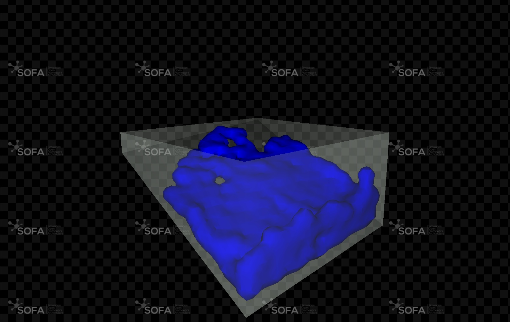
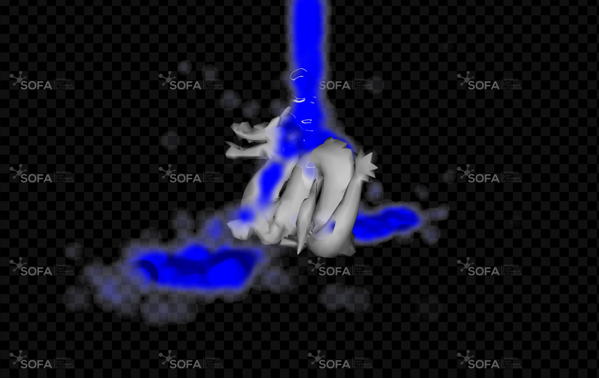

# SofaSphFluid plugin

## Description

This SOFA SPH Plugin enables advanced simulations of fluid-object interactions using the Smoothed Particle Hydrodynamics (SPH) method. 
It allows realistic modeling of fluid dynamics, where fluids and solids interact seamlessly, making it ideal for applications mixing computational fluid dynamics and soft body simulations. 

Here are a some results of the integration:
|||
|--|--|
| 
SPH against physical barriers
 | 
SPH interaction with 3D mesh 
|

Smoothed Particle Hydrodynamics (SPH) is a computational method used for simulating the behavior of fluids. 
In SPH, the fluid is represented by a collection of particles, each carrying properties such as mass, position, velocity, and pressure. 
The fluid's properties are computed by smoothing functions over these particles, allowing for the accurate simulation of fluid flow, turbulence, and fluid-object interactions. 
SPH is widely used in applications like fluid dynamics, astrophysics, and special effects in computer graphics due to its flexibility and ability to handle complex free-surface flows.

   

## Build instructions

This plugin relies on the open-source project SOFA. To build the sources of this plugin, you can follow the associated "[Build a plugin from sources](https://sofa-framework.github.io/doc/plugins/build-a-plugin-from-sources/)" documentation page.

## Documentation

- [API Documentation](https://sofa-framework.github.io/doc/plugins/usual-plugins/sofasphfluid/oglfluidmodel/)

## Licence:

This plugin is LGPL
LGPL refers to the GNU Lesser General Public License as published by the Free Software Foundation; either version 2.1 of the License, or (at your option) any later version.

If this work is useful for your industrial application, your [support](https://www.sofa-framework.org/consortium/support-us/) would be most welcome.

